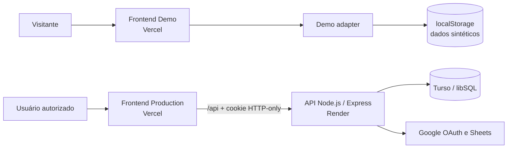

# Cofre

**Controle financeiro pessoal com histórico, cartões, recorrências, análises e sincronização opcional com Google Sheets.**

[Live Demo](https://cofre-demo.vercel.app/) · [Arquitetura](docs/architecture/index.md) · [Domínio](docs/domain/index.md) · [ADRs](docs/decisions/index.md) · [Swagger / API](#visão-geral-da-api) · [Executar localmente](#quickstart)

> **Status:** aplicação em uso real, Fases 1–5 concluídas e ambiente público de demonstração disponível. A Fase 6 — Documentação e Engenharia de Software está em andamento, com as Etapas 14 a 19 concluídas.

## Por que o Cofre existe

O Cofre nasceu da necessidade de substituir uma planilha financeira pessoal por uma aplicação estruturada, acessível no computador e no Safari do iPhone, sem perder a visão histórica nem a possibilidade de trabalhar com planilhas.

A solução combina uma aplicação web responsiva, uma API que concentra regras e segurança, persistência multiusuário e uma integração opcional com Google Sheets. Para apresentar o produto sem expor dados ou infraestrutura pessoais, o mesmo frontend também gera uma Demo totalmente isolada no navegador.

## Principais funcionalidades

- Receitas e despesas com categoria, data, competência, status, observações e filtros.
- Dashboard mensal, histórico pesquisável e análises por período e categoria.
- Navegação por meses passados e futuros, incluindo parcelas e recorrências previstas.
- Categorias personalizáveis com cores e ícones.
- Cartões de crédito com fechamento, vencimento, limite utilizado e pagamento de fatura.
- Compras parceladas com geração atômica das parcelas e ajuste de centavos.
- Gastos recorrentes com materialização mensal idempotente e preservação opcional do histórico na exclusão.
- Exclusões definitivas com prévia de impacto e gerenciamento destrutivo user-scoped.
- Google OAuth, whitelist de e-mails, cookies HTTP-only e sessões persistidas no banco.
- Perfil e preferência de tema (`system`, `light` ou `dark`) por usuário.
- Google Sheets opcional, com planilha anual legível, importação de despesas simples e sincronização manual auditável.
- Interface responsiva com navegação adaptada para desktop e dispositivos móveis.

## Dois ambientes, uma base de código

| Ambiente | Finalidade | Dados e integrações |
| --- | --- | --- |
| **Production** | Uso pessoal real | Google OAuth, API no Render, Turso e Google Sheets. A URL pessoal não é divulgada como demonstração. |
| **Public Demo / Sandbox** | Avaliação pública do produto | Usuário e dados sintéticos, persistência em `localStorage`, sem backend, OAuth, Turso, cookies ou Google APIs. |

Na Demo, o visitante pode explorar o dashboard e as análises, além de criar, editar e excluir movimentações, categorias, cartões e gastos recorrentes. Parcelamentos, limite de cartão, pagamento de fatura e geração de recorrências também são simulados localmente. O botão **Resetar demonstração** remove somente o namespace `cofre:demo:v1` e restaura o seed original.

O isolamento ocorre no build: o Vite troca o cliente HTTP por um adapter local. O build Demo rejeita `VITE_API_URL`, e seu deployment aplica `connect-src 'none'`, impedindo conexões externas pelo bundle publicado.

## Stack tecnológica

| Camada | Tecnologias |
| --- | --- |
| Frontend | React 19, Vite 8, React Router 7, Tailwind CSS 4, Recharts e Lucide React |
| Backend | Node.js 22, Express 5, Zod 4 e Node Test Runner |
| Dados | libSQL com `@libsql/client`; SQLite local e Turso em produção |
| Autenticação | Google OAuth 2.0 com Authorization Code, PKCE, `state`, nonce e sessão HTTP-only |
| Integração | Google Sheets API e escopo limitado `drive.file` |
| Deploy | Vercel (frontend Production e Demo), Render (API) e Turso (banco) |

## Arquitetura resumida

O frontend consome contratos de serviço comuns nos dois modos. Em produção, esses serviços usam o cliente HTTP; na Demo, um alias resolvido durante o build aponta para o repositório no navegador. No backend, rotas e controllers cuidam da borda HTTP, services orquestram os casos de uso, funções de domínio concentram cálculos e repositories encapsulam SQL.

```text
Frontend: página → hook/context → service → API client ou Demo adapter
Backend:  rota → autenticação/validação → controller → service → domínio/repository → libSQL
```



As entidades privadas são associadas ao usuário autenticado. Os repositories combinam o identificador do recurso com `user_id`, e o banco adiciona constraints e triggers para impedir relações entre recursos de usuários diferentes.

## Quickstart

Requisito: **Node.js 22.x**.

### Demo local — sem backend ou credenciais

```bash
git clone https://github.com/felipeft/cofre.git
cd cofre/frontend
npm ci
VITE_APP_MODE=demo npm run dev
```

Acesse `http://localhost:5173`. Não defina `VITE_API_URL` no modo Demo.

### Aplicação completa

Em dois terminais:

```bash
# Terminal 1 — API
cd backend
cp .env.example .env
npm ci
npm run dev
```

```bash
# Terminal 2 — frontend
cd frontend
cp .env.example .env
npm ci
npm run dev
```

Por padrão, o frontend fica em `http://localhost:5173` e encaminha `/api` para a API em `http://localhost:3000`. O bootstrap do backend executa automaticamente as migrations pendentes.

O fluxo completo exige um cliente OAuth Web configurado no Google Cloud, incluindo os callbacks locais de autenticação e Google Sheets.

## Configuração de ambiente

Use [`backend/.env.example`](backend/.env.example) e [`frontend/.env.example`](frontend/.env.example) como referência. Arquivos `.env` reais e secrets não devem ser versionados.

### Backend

| Variável | Responsabilidade |
| --- | --- |
| `PORT`, `NODE_ENV`, `LOG_LEVEL` | Processo e logs da API |
| `FRONTEND_URLS` | Origins permitidas pelo CORS, separadas por vírgula |
| `DATABASE_PATH` | Arquivo libSQL/SQLite no desenvolvimento |
| `TURSO_DATABASE_URL`, `TURSO_AUTH_TOKEN` | Banco remoto; obrigatórias em produção |
| `GOOGLE_CLIENT_ID`, `GOOGLE_CLIENT_SECRET`, `GOOGLE_CALLBACK_URL` | Login Google |
| `AUTH_ALLOWED_EMAILS` | Whitelist normalizada de e-mails |
| `AUTH_LEGACY_OWNER_EMAIL` | Migração explícita de dados anteriores à autenticação, quando aplicável |
| `SESSION_SECRET`, `SESSION_TTL_DAYS`, `SESSION_COOKIE_NAME` | Sessões persistentes e cookie |
| `GOOGLE_SHEETS_CALLBACK_URL` | Callback da autorização incremental do Sheets |
| `GOOGLE_TOKEN_ENCRYPTION_KEY` | Chave de 32 bytes para criptografar refresh tokens |

### Frontend

| Variável | Uso |
| --- | --- |
| `VITE_APP_MODE=production` | Ativa o cliente HTTP real |
| `VITE_API_URL=/api` | Base centralizada da API Production |
| `VITE_APP_MODE=demo` | Ativa exclusivamente o adapter e storage locais |

O deployment Demo configura somente `VITE_APP_MODE=demo`.

## Testes e validações

```bash
# Backend: testes unitários e de integração
cd backend
npm test
```

```bash
# Frontend: análise estática, testes da infraestrutura Demo e build Production
cd frontend
npm run lint
npm run test:demo
npm run build
```

```bash
# Build Demo + auditoria de isolamento
# Execute sem VITE_API_URL no ambiente ou em arquivos .env carregados pelo Vite.
cd frontend
npm run build:demo
```

Os testes do backend usam bancos temporários e cobrem domínio, migrations, autenticação, isolamento entre usuários, CRUD, exclusões, cartões, parcelamentos, recorrências e Google Sheets. A suíte Demo valida seed, persistência, CRUD, regras principais e reset do armazenamento local. O build Demo também procura endpoints, hosts privados e padrões de secrets no artefato final.

## Visão geral da API

As respostas seguem um envelope consistente de sucesso ou erro. Salvo health check e fluxo de autenticação, as rotas exigem sessão válida e utilizam o usuário obtido no backend — não um `userId` fornecido pelo cliente.

Com o backend em execução, a especificação completa pode ser consultada na Swagger UI em [`/api-docs`](http://localhost:3000/api-docs) ou como OpenAPI 3.1 JSON em [`/openapi.json`](http://localhost:3000/openapi.json).

| Grupo | Operações principais |
| --- | --- |
| `/health`, `/version`, `/status` | Saúde e metadados da API |
| `/auth/*` | Login Google, callback, sessão atual e logout |
| `/profile`, `/settings` | Perfil e preferência visual do usuário atual |
| `/categories` | CRUD e prévia de exclusão de categorias |
| `/transactions` | CRUD, filtros, paginação, resumo e prévia de exclusão |
| `/cards` | CRUD, resumo de limite, prévia de exclusão e pagamento de fatura |
| `/recurring-expenses` | CRUD, geração idempotente e políticas de exclusão |
| `/data-management` | Prévia, limpeza de registros e reset financeiro |
| `/integrations/google-sheets` | Autorização, planilha, importação, exportação, sincronização e histórico |

Dashboard e análises são calculados no frontend a partir das transações retornadas pela API; não existem endpoints dedicados para essas duas telas no estado atual.

## Deploy e ambientes

```text
GitHub
├── Vercel Production → frontend/ → proxy /api → Render → Turso
└── Vercel Demo       → raiz      → build:demo → localStorage
```

- **Production:** o `frontend/vercel.json` encaminha `/api` ao Render para manter o cookie first-party no Safari. Dados e sessões persistem no Turso.
- **Demo:** o `vercel.json` da raiz gera apenas o frontend local e aplica uma Content Security Policy sem conexões externas.
- **Migrations:** são sequenciais, forward-only, registradas em `schema_migrations` e executadas no bootstrap da API.

## Documentação

A [documentação arquitetural](docs/architecture/index.md) usa C4 Model, Structurizr DSL e fluxos Mermaid. A [documentação do domínio](docs/domain/index.md) registra as regras financeiras, seus motivos, exemplos e débitos conhecidos. Os [Architecture Decision Records](docs/decisions/index.md) preservam contexto, alternativas e consequências das escolhas relevantes. A [documentação da API](docs/api/index.md) explica o contrato OpenAPI e o uso da Swagger UI. A [documentação do banco](docs/database/index.md) registra o modelo relacional, migrations e garantias de integridade. As próximas etapas ampliarão `docs/` com estratégia de testes, operação e publicação com MkDocs Material.

Enquanto essa documentação é preparada, existem guias específicos para o [`backend`](backend/README.md) e o [`frontend`](frontend/README.md).

## Roadmap resumido

- [x] Fases 1–2 — fundação, domínio financeiro, CRUD e integração frontend/backend.
- [x] Fase 3 — cartões, parcelamentos e gastos recorrentes.
- [x] Fase 4 — autenticação Google, sessões, perfil e configurações por usuário.
- [x] Fase 5 — Google Sheets e sincronização manual auditável.
- [x] Ambiente público Demo/Sandbox isolado.
- [ ] **Fase 6 — documentação e engenharia de software.**
  - [x] Etapa 14 — README Profissional.
  - [x] Etapa 15 — Documentação Arquitetural com C4 Model e Structurizr DSL.
  - [x] Etapa 16 — Documentação do Domínio.
  - [x] Etapa 17 — Architecture Decision Records.
  - [x] Etapa 18 — OpenAPI 3.1 e Swagger UI.
  - [x] Etapa 19 — Documentação de Banco de Dados.
  - [ ] Etapas 20–22 — testes, operação e MkDocs.
- [ ] Fase 7 — inteligência financeira, relatórios e metas.
- [ ] Fase 8 — engenharia, qualidade, governança e observabilidade de dados.
- [ ] Fase 9 — inteligência artificial, machine learning e MLOps.
- [ ] Fase 10 — revisão final, containerização, CI/CD e refinamentos.

Sincronização automática, documentação técnica completa, observabilidade, Docker e CI/CD permanecem no roadmap e não são apresentados como funcionalidades atuais.

## Estado atual

- Aplicação Production funcional e utilizada no dia a dia em desktop e Safari no iPhone.
- Demo pública funcional em [cofre-demo.vercel.app](https://cofre-demo.vercel.app/), sem acesso à infraestrutura pessoal.
- Fases 1–5 concluídas; Etapas 14 a 19 da Fase 6 concluídas, sem antecipar a Etapa 20.
