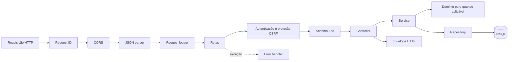

# C4 Nível 3 — Backend API

O backend é uma aplicação Node.js/Express organizada por responsabilidades. `server.js` prepara o banco e inicia a porta; `app.js` monta a aplicação sem abrir rede, permitindo testes da composição HTTP.

## Pipeline de uma requisição

As rotas de sistema e autenticação são montadas antes da proteção global. Categorias, transações, cartões, recorrências, perfil, settings, gerenciamento de dados e Google Sheets passam por `requireAuth` e proteção de origem nas mutações.

## Componentes arquiteturais

| Componente | Responsabilidade |
| --- | --- |
| Borda HTTP | Middlewares, routes, validação Zod, controllers, envelopes e tradução de erros. |
| Autenticação e sessões | OAuth/OIDC, PKCE, `state`, nonce, whitelist, cookie e sessão persistente. |
| Serviços de conta | Perfil e preferência visual do usuário atual. |
| Serviços financeiros | Casos de uso de categorias, transações, cartões, pagamentos, parcelas e recorrências. |
| Domínio financeiro | Funções puras de parcelamento, limite, resumo e geração mensal. |
| Gerenciamento de dados | Preview e exclusões em transações atômicas, sempre por usuário. |
| Integração Google Sheets | Autorização incremental, layout anual, mapeamento, importação e exportação. |
| Orquestrador de sincronização | Idempotência, exclusão mútua, conflitos, status e histórico da operação manual. |
| Repositories | SQL parametrizado, filtros `id + user_id`, transações e adaptação à fachada libSQL. |

Controllers permanecem finos: extraem `req.user` e dados já validados, chamam um service e constroem a resposta. Mappers convertem linhas `snake_case` em contratos `camelCase`, mas não são representados como componentes C4 independentes.

## Bootstrap e persistência

Antes de aceitar requisições, o bootstrap cria a conexão e executa migrations SQL pendentes, uma a uma e dentro de transações. A fachada em `database/connection.js` oferece a mesma API assíncrona para arquivo local e Turso, com foreign keys habilitadas e concorrência de conexão igual a 1.

Recorrências não são geradas globalmente no bootstrap, pois dependem do usuário autenticado. A conciliação acontece ao consultar os casos de uso relevantes e avança por checkpoint mensal.

## Ownership e transações

- A identidade vem da sessão carregada pelo middleware.
- Services e repositories sempre recebem o `userId` confiável do backend.
- Consultas de recursos combinam ownership e ID para evitar acesso cruzado.
- Triggers de banco impedem vínculos entre categoria, cartão, recorrência e transação de usuários diferentes.
- Parcelas, reconciliação de recorrências, importação e operações destrutivas utilizam batch ou transações conforme o caso de uso.

A view canônica correspondente é `BackendComponents` em [`workspace.dsl`](structurizr/workspace.dsl).
