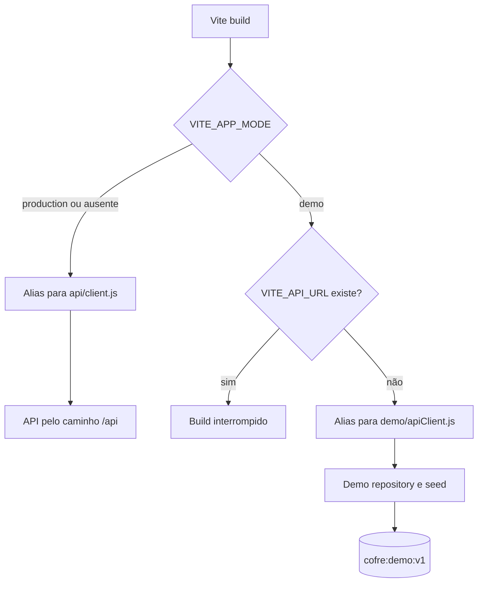

# C4 Nível 3 — Frontend

O frontend é uma SPA React. Páginas e componentes não conhecem hosts externos: o acesso a dados passa por services e por um cliente selecionado no build.

## Componentes arquiteturais

| Componente | Responsabilidade |
| --- | --- |
| UI e roteamento | `App`, páginas, `AppShell`, formulários, gráficos e componentes responsivos. |
| Estado e coordenação | Hooks e Contexts para autenticação, settings, categorias, cartões, recorrências e mutações de transações. |
| Serviços de frontend | Contratos por domínio e composição dos payloads/endpoints. Dashboard e análises agregam transações no cliente. |
| Cliente HTTP Production | Base URL centralizada, `credentials: 'include'`, envelopes de resposta e propagação de `401`. |
| Demo API adapter | Implementação local dos mesmos métodos `get/post/put/patch/delete`, sem `fetch`. |
| Domínio e seed da Demo | Dados sintéticos e regras suficientes para CRUD, parcelas, recorrências e limite de cartão. |

## Fluxo de dados

```text
Página/componente
  → hook ou Context
    → service de domínio
      → @cofre-api-client
        ├── Production: api/client.js → Backend API
        └── Demo:       demo/apiClient.js → Demo repository → localStorage
```

Mutações são confirmadas pela fonte de dados antes de atualizar a interface. O Histórico busca páginas e filtros próprios; Dashboard e Análises carregam janelas temporais por `usePeriodTransactions` e calculam seus modelos de visualização em funções do frontend.

## Seleção Production versus Demo



O alias `@cofre-api-client` evita condicionais `if (demoMode)` espalhadas pela UI. O build também seleciona fontes locais para a Demo. Um script posterior ao build procura hosts privados, endpoints e padrões de secrets; o deployment adiciona CSP sem conexões externas.

## Autenticação na UI

`AuthProvider` consulta `/auth/me`; `AuthGate` mantém o estado de carregamento e decide entre login e aplicação. O token de sessão nunca entra no estado React. `SettingsProvider` é separado do contexto de autenticação e aplica a preferência visual persistida.

A view canônica correspondente é `FrontendComponents` em [`workspace.dsl`](structurizr/workspace.dsl). A composição reduzida da Demo está em `DemoComponents`.
