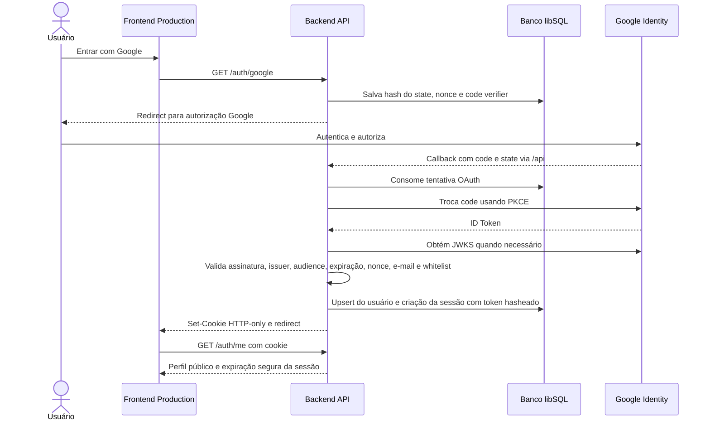
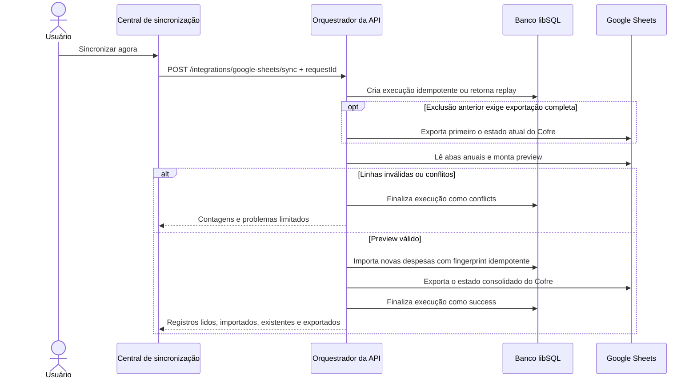

# Integrações externas e fluxos

## Google OAuth / OpenID Connect

O login é conduzido pelo backend. O frontend não recebe access token, ID Token ou token de sessão.

Em produção, o cookie é `Secure`, `HttpOnly`, `SameSite=Lax` e tem duração configurável. A sessão fica no banco, pode ser renovada quando passa da metade do TTL e é invalidada se o e-mail deixar a whitelist.

## Google Drive e Sheets

A integração é opcional e user-scoped. Um segundo fluxo OAuth solicita `openid email` e o escopo `drive.file`, verifica que a conta Google corresponde ao usuário autenticado e criptografa o refresh token com AES-GCM antes da persistência.

O backend cria uma planilha e gerencia abas por ano. A exportação reescreve a área controlada pelo Cofre; a importação aceita novas despesas simples e valida schema, ownership, referências, hashes e conflitos antes de gravar.

### Sincronização manual

Falhas são registradas no histórico antes de serem propagadas. Uma execução ativa bloqueia outra para o mesmo usuário. Sincronização automática está modelada no schema como possível origem futura, mas não é executada pelo código atual.

## Turso

Turso hospeda o container lógico **Banco de dados principal** em Production. A API escolhe Turso quando `TURSO_DATABASE_URL` e `TURSO_AUTH_TOKEN` estão configurados; testes ignoram essas credenciais e usam arquivos temporários.

## Vercel e Render

- **Vercel Production:** publica os assets do frontend e encaminha `/api` ao backend no Render.
- **Render:** executa o processo Node.js/Express e acessa o Turso e as APIs Google.
- **Vercel Demo:** projeto independente apontando para o mesmo repositório, mas executando `build:demo` sem URL de API.

Esses provedores pertencem à perspectiva de deployment. Eles não substituem os elementos lógicos Frontend, API e Banco no modelo C4.

## Restrições da Public Demo

A Demo apresenta a integração Google como indisponível, não inicia redirects externos e não envia dados. Seu adapter implementa respostas locais; o build rejeita `VITE_API_URL`, é auditado após a compilação e recebe uma CSP com `connect-src 'none'`.
