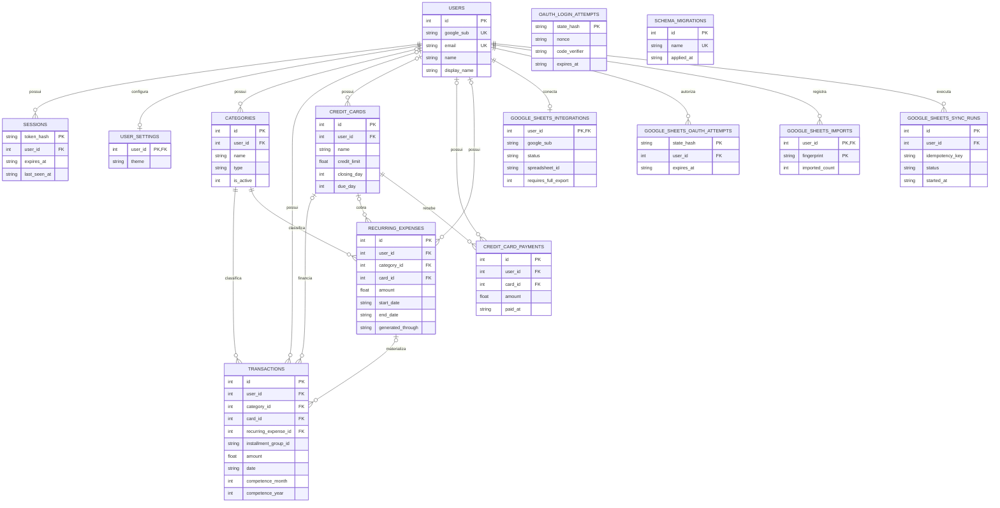

# Modelo de dados atual

## Diagrama ER

O diagrama contém somente tabelas físicas. As relações tracejadas não são
usadas: toda aresta abaixo corresponde a uma FK real. `oauth_login_attempts` e
`schema_migrations` aparecem isoladas porque não possuem FK.

`USERS ||--o| USER_SETTINGS` representa a cardinalidade imposta pelo banco: uma
linha de settings pertence a exatamente um usuário, mas um usuário pode ter
zero ou uma linha. O estado esperado pela aplicação é 1:1 após o trigger
`users_create_settings`; o repository usa `INSERT OR IGNORE` como defesa
adicional caso a linha esteja ausente.

Nas cinco relações financeiras iniciadas por `USERS o|--o{`, o marcador `o|`
reflete o `user_id` nullable preservado para compatibilidade com dados legados.
Os fluxos normais da aplicação sempre fornecem o owner, mas essa presença não
é obrigatória no schema.

## Identidade, sessão e preferências

### `users`

Identidade local vinculada ao Google. Não armazena senha nem tokens OAuth.

| Campo | Tipo/restrição | Papel |
| --- | --- | --- |
| `id` | INTEGER PK autoincrement | Identidade interna e owner dos dados |
| `google_sub` | TEXT NOT NULL UNIQUE | Identificador externo estável do Google |
| `email` | TEXT NOT NULL UNIQUE, `NOCASE` | E-mail normalizado; identidade secundária |
| `name` | TEXT NOT NULL | Nome fornecido pelo Google |
| `display_name` | TEXT nullable, CHECK 1–80 após trim | Nome preferido no Cofre |
| `avatar_url` | TEXT nullable | Avatar externo |
| `created_at`, `updated_at` | TEXT NOT NULL | Auditoria básica |

### `sessions`

Sessões persistentes. O browser recebe o token opaco, mas o banco guarda
somente seu hash.

| Campo | Tipo/restrição | Papel |
| --- | --- | --- |
| `token_hash` | TEXT PK, sem NOT NULL explícito | Identificador não reversível da sessão |
| `user_id` | INTEGER NOT NULL FK → `users`, CASCADE | Usuário autenticado |
| `created_at` | TEXT NOT NULL | Início da sessão |
| `expires_at` | TEXT NOT NULL | Expiração absoluta/renovada |
| `last_seen_at` | TEXT NOT NULL | Atualizado quando a sessão é renovada |

### `oauth_login_attempts`

Estado efêmero do login antes de existir uma identidade autenticada. Por isso
não possui `user_id`.

| Campo | Tipo/restrição | Papel |
| --- | --- | --- |
| `state_hash` | TEXT PK, sem NOT NULL explícito | Correlação segura do callback |
| `nonce`, `code_verifier` | TEXT NOT NULL | Proteções OIDC/PKCE |
| `created_at`, `expires_at` | TEXT NOT NULL | Janela de validade |

### `user_settings`

Preferências extensíveis sem inflar `users`. A aplicação mantém uma linha
por usuário; estruturalmente, a cardinalidade é 0..1 porque a FK não obriga a
existência da linha filha.

| Campo | Tipo/restrição | Papel |
| --- | --- | --- |
| `user_id` | INTEGER PK/FK → `users`, CASCADE | Owner e identidade da linha |
| `theme` | TEXT NOT NULL, default `system`, CHECK enum | `system`, `light` ou `dark` |
| `created_at`, `updated_at` | TEXT NOT NULL | Auditoria básica |

## Núcleo financeiro

### `categories`

Classifica receitas e despesas. O nome é único apenas dentro do mesmo usuário
e tipo, sem diferenciar maiúsculas/minúsculas.

| Campo | Tipo/restrição | Papel |
| --- | --- | --- |
| `id` | INTEGER PK autoincrement | Identidade |
| `user_id` | INTEGER nullable, FK → `users`, CASCADE | Ownership; nullable por compatibilidade legado |
| `name` | TEXT NOT NULL | Rótulo |
| `type` | TEXT NOT NULL, CHECK | `income` ou `expense` |
| `color`, `icon` | TEXT NOT NULL | Metadados de apresentação |
| `is_active` | INTEGER NOT NULL default 1, CHECK 0/1 | Disponibilidade para novos registros |
| `sort_order` | INTEGER NOT NULL default 0 | Ordem de apresentação |
| `created_at`, `updated_at` | TEXT NOT NULL | Auditoria básica |

### `transactions`

Fato financeiro central. Cada linha é uma receita ou despesa; parcelas e
ocorrências recorrentes também são fatos nesta tabela.

| Grupo | Campos | Restrições/papel |
| --- | --- | --- |
| Identidade/owner | `id`, `user_id` | PK autoincrement; FK owner nullable por legado, CASCADE |
| Valor/tipo | `description`, `amount`, `type` | descrição default vazia; `amount > 0`; tipo income/expense |
| Categoria | `category_id` | NOT NULL FK → `categories`, RESTRICT |
| Temporal | `date`, `competence_month`, `competence_year` | data textual; mês CHECK 1–12; competência usada em resumos |
| Conteúdo | `notes`, `source`, `tags` | defaults `''`, `manual`, `'[]'`; tags é JSON textual |
| Flags/estado | `is_recurring`, `is_fixed`, `status` | booleanos CHECK 0/1; status pending/confirmed/cancelled |
| Cartão | `card_id`, `card` | `card_id` é FK nullable → cartão, RESTRICT; `card` é texto legado ainda aceito na entrada e persistido |
| Parcelamento | `installment_current`, `installment_total`, `installment_group_id` | metadados nullable; grupo não é FK nem entidade própria |
| Recorrência | `recurring_expense_id` | FK nullable → definição, RESTRICT |
| Auditoria | `created_at`, `updated_at` | TEXT NOT NULL |

O valor, data, competência e metadados da parcela/ocorrência ficam
materializados. A transação não guarda snapshot do nome/cor da categoria nem
do nome do cartão: a apresentação atual faz JOIN com essas entidades.

### `credit_cards`

Configuração do meio de pagamento; não representa uma fatura materializada.

| Campo | Tipo/restrição | Papel |
| --- | --- | --- |
| `id` | INTEGER PK autoincrement | Identidade |
| `user_id` | INTEGER nullable, FK → `users`, CASCADE | Ownership legado/atual |
| `name` | TEXT NOT NULL | Único por usuário, `NOCASE` |
| `credit_limit` | REAL NOT NULL, CHECK > 0 | Limite contratado |
| `closing_day`, `due_day` | INTEGER NOT NULL, CHECK 1–31 | Ciclo usado na competência das parcelas |
| `is_active` | INTEGER NOT NULL default 1, CHECK 0/1 | Aceitação de novas compras |
| `created_at`, `updated_at` | TEXT NOT NULL | Auditoria básica |

### `credit_card_payments`

Registra liberações de limite. Um pagamento não é uma segunda despesa.

| Campo | Tipo/restrição | Papel |
| --- | --- | --- |
| `id` | INTEGER PK autoincrement | Identidade |
| `user_id` | INTEGER nullable, FK → `users`, CASCADE | Ownership legado/atual |
| `card_id` | INTEGER NOT NULL FK → `credit_cards`, RESTRICT | Cartão pago |
| `amount` | REAL NOT NULL, CHECK > 0 | Valor liberado |
| `paid_at` | TEXT NOT NULL | Data do pagamento |
| `notes` | TEXT NOT NULL default `''` | Observação |
| `created_at` | TEXT NOT NULL | Auditoria de criação |

### `recurring_expenses`

Definição de repetição mensal, separada das ocorrências materializadas em
`transactions`.

| Grupo | Campos | Restrições/papel |
| --- | --- | --- |
| Identidade/owner | `id`, `user_id` | PK autoincrement; FK owner nullable por legado, CASCADE |
| Regra | `description`, `amount`, `type`, `category_id` | valor > 0; tipo fixo `expense`; categoria RESTRICT |
| Calendário | `day_of_month`, `start_date`, `end_date` | dia 1–31; fim nulo ou lexicamente ≥ início |
| Progresso | `generated_through` | competência `YYYY-MM-01` já reconciliada |
| Cartão | `card_id` | FK nullable → `credit_cards`, RESTRICT |
| Estado/conteúdo | `is_active`, `notes`, `source` | flag 0/1; defaults `''` e `recurring` |
| Auditoria | `created_at`, `updated_at` | TEXT NOT NULL |

O índice único parcial em `transactions` assegura no máximo uma ocorrência
por `recurring_expense_id` e competência. A decisão é detalhada no
[ADR-0004](../decisions/0004-recorrencias-com-ocorrencias-materializadas.md).

## Google Sheets e sincronização

### `google_sheets_integrations`

Uma integração no máximo por usuário.

| Grupo | Campos | Papel/restrição |
| --- | --- | --- |
| Identidade | `user_id` | PK/FK → `users`, CASCADE |
| Conta Google | `google_sub`, `google_account_email` | Identidade autorizada |
| Credencial | `refresh_token_encrypted`, `granted_scopes` | Token cifrado nullable e scopes concedidos |
| Estado | `status` | authorized/ready/reauthorization_required/file_missing |
| Planilha | `spreadsheet_id`, `spreadsheet_name`, `start_year` | ano nulo ou 1900–9999; ready exige spreadsheet_id |
| Reconciliação | `requires_full_export` | flag 0/1 que força exportação antes de importar |
| Operação | `connected_at`, `last_export_at`, `last_import_at`, `last_error_code`, `last_error_at` | Estado operacional |
| Auditoria | `created_at`, `updated_at` | TEXT NOT NULL |

### `google_sheets_oauth_attempts`

Tentativas efêmeras de autorização Drive/Sheets, associadas ao usuário já
autenticado: `state_hash` PK, `user_id` FK CASCADE, `nonce`, `code_verifier`,
`created_at` e `expires_at`.

Assim como nas tentativas de login, `state_hash` é uma PK textual sem
`NOT NULL` explícito no DDL.

### `google_sheets_imports`

Ledger mínimo de idempotência de importação. A PK composta
`(user_id, fingerprint)` impede aplicar novamente o mesmo conjunto validado;
`imported_count` é não negativo e `imported_at` registra a aplicação.

### `google_sheets_sync_runs`

Histórico auditável de sincronizações.

| Grupo | Campos | Papel/restrição |
| --- | --- | --- |
| Identidade | `id`, `user_id`, `idempotency_key` | PK; owner CASCADE; chave única por usuário |
| Estado | `trigger_source`, `status` | manual/automatic; running/success/conflicts/failed |
| Contadores | `records_read`, `records_imported`, `records_existing`, `records_exported`, `conflict_count`, `invalid_count` | inteiros não negativos, default 0 |
| Diagnóstico | `details_json`, `error_code`, `error_message` | JSON textual e erro opcional |
| Tempo | `started_at`, `completed_at`, `created_at` | início/criação obrigatórios; conclusão nullable |

Um índice único parcial permite somente uma execução `running` por usuário.
A chave de idempotência não é única isoladamente: a constraint é composta por
`(user_id, idempotency_key)`.
A estratégia completa está no
[ADR-0008](../decisions/0008-sincronizacao-manual-idempotente.md).

## Infraestrutura

### `schema_migrations`

Criada pelo migrator, não por arquivo numerado. Possui `id` autoincrement,
`name` único e `applied_at`. Ela registra que um arquivo foi aplicado; não
armazena checksum nem script de rollback.
