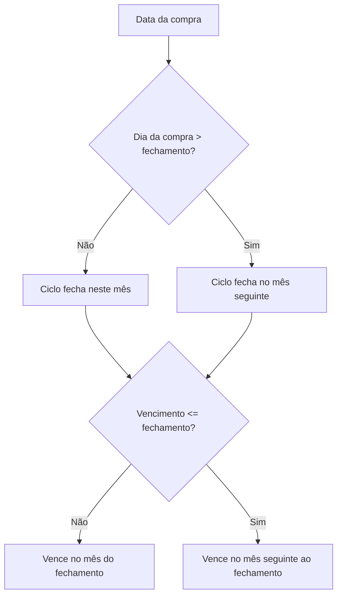

# Cartões de crédito e parcelamentos

## Cartão e elegibilidade

**Regra de domínio.** Cartão é meio de pagamento exclusivo de despesas. Receitas não podem usar cartão nem ser parceladas por esse mecanismo.

**Regra de domínio.** O nome do cartão é único por usuário, sem diferenciar maiúsculas de minúsculas. O limite deve ser positivo; fechamento e vencimento usam dias de 1 a 31.

**Decisão de aplicação.** Um cartão inativo preserva todo o histórico, mas rejeita novas compras e novos vínculos recorrentes. Inativação é diferente de exclusão: a exclusão física somente é permitida quando não existem transações, pagamentos ou definições recorrentes vinculadas.

## Compra simples e compra parcelada

Uma despesa simples no cartão produz uma única transação. Para uma compra com mais de uma parcela, o conjunto das parcelas **é** a compra: não existe uma linha adicional com o valor total.

**Regra de domínio.** Uma compra de valor `V` em `N` parcelas gera exatamente `N` transações que compartilham um identificador de grupo e registram a posição `1/N`, `2/N` … `N/N`.

**Detalhe técnico atual.** O lote inteiro é persistido atomicamente. Se qualquer parcela falhar, nenhuma delas permanece no banco. Isso evita compras parcialmente materializadas.

## Fechamento, vencimento e competência

Fechamento e vencimento determinam a data da primeira parcela:

1. Compra feita até o dia de fechamento, inclusive, entra no ciclo que fecha naquele mês.
2. Compra posterior ao fechamento entra no ciclo seguinte.
3. Se o vencimento é posterior ao fechamento, vence no mesmo mês do fechamento.
4. Se o vencimento é anterior ou igual ao fechamento, vence no mês seguinte ao fechamento.



Cada parcela seguinte vence um mês depois. Quando um dia não existe no mês de destino, usa-se o último dia válido do mês, evitando rollover acidental.

Exemplo: compra de R$ 1.200 em 12 vezes, em `20/08/2026`, num cartão que fecha dia 10 e vence dia 20. Como a compra ocorreu após o fechamento, a primeira parcela vence em `20/09/2026`; a última, em `20/08/2027`.

**Regra de domínio.** A data e a competência de cada parcela correspondem ao seu próprio vencimento. Isso distribui o compromisso pelos meses em que cada parcela é devida.

**Limite do modelo atual.** Fechamento e vencimento são aplicados na geração de parcelamentos. Uma compra simples mantém a data informada, e uma ocorrência recorrente com cartão mantém seu dia mensal; não existe uma entidade formal de fatura que reagrupe esses lançamentos por ciclo.

## Distribuição e arredondamento

**Regra de domínio.** Valores são arredondados para duas casas, e qualquer diferença de centavos é absorvida pela última parcela. A soma das parcelas deve ser exatamente o valor original.

Exemplo:

| Parcela | R$ 100 em 3 vezes |
| --- | ---: |
| 1/3 | R$ 33,33 |
| 2/3 | R$ 33,33 |
| 3/3 | R$ 33,34 |
| **Total** | **R$ 100,00** |

Isso evita criar ou perder dinheiro por arredondar cada divisão isoladamente.

## Comprometimento de limite

```text
compras comprometidas = soma das transações do cartão com status diferente de cancelled
limite usado          = max(0, compras comprometidas − pagamentos registrados)
limite disponível     = limite total − limite usado
```

**Regra de domínio.** Todas as parcelas são consideradas desde a criação, inclusive as de competência futura. O limite representa o compromisso total assumido, não apenas o que já venceu.

**Regra de domínio.** Cada transação contribui uma única vez. Ocorrências recorrentes com cartão também são transações únicas e não recebem parcelamento implícito.

**Decisão de aplicação.** O Cofre não bloqueia uma compra por ultrapassar o limite cadastrado; nesse caso, o disponível fica negativo. O limite funciona como indicador e não como autorização bancária.

## Pagamento do cartão

**Regra de domínio.** Registrar pagamento libera limite, mas não cria uma nova despesa. A compra original já afetou as finanças; criar outra transação para o pagamento duplicaria o gasto.

Um pagamento deve ser positivo e não pode exceder o limite usado naquele momento. Pagamentos são acumulados e preservados como registros próprios do cartão.

**Limite do modelo atual.** O pagamento não é associado a uma fatura ou competência específica. Ele reduz o compromisso acumulado de todas as compras não canceladas. Por isso, o modelo descreve pagamento de cartão, não conciliação bancária completa de faturas.

## Edição e exclusão de parcelas

**Decisão de aplicação.** Editar uma parcela altera apenas aquela transação; o Cofre não redistribui diferença, datas ou metadados nas parcelas irmãs. Excluir também atua apenas sobre a parcela escolhida, após exibir o tamanho do grupo na prévia.

Essa autonomia evita mutações em massa implícitas no histórico. Uma operação de edição do parcelamento inteiro exigiria uma regra própria e não existe no estado atual.
