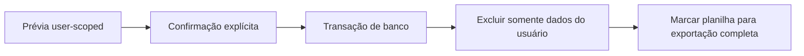

# Ciclo de vida e exclusão de dados

## Princípio geral

**Regra de domínio.** Quando a interface oferece exclusão, ela significa remoção física, salvo uma escolha explícita de preservação histórica. O Cofre não usa soft delete para fazer registros apenas desaparecerem da tela.

**Decisão de aplicação.** Antes das operações destrutivas relevantes, o sistema calcula uma prévia com contagens e impactos. As operações em massa exigem frases literais de confirmação e são executadas de forma transacional e user-scoped.

## Exclusões individuais

| Entidade | Regra atual | Motivo |
| --- | --- | --- |
| Transação | Exclui fisicamente somente o registro selecionado. | Dá controle sobre o fato e remove seus efeitos derivados. |
| Parcela | Exclui somente a parcela selecionada. | Evita apagar silenciosamente todo o grupo. |
| Categoria | Exclui somente se não houver transações nem recorrências vinculadas. | Preserva a interpretação do histórico e a integridade referencial. |
| Cartão | Exclui somente se não houver transações, pagamentos nem recorrências vinculadas. | Preserva compras, pagamentos e regras que identificam o cartão. |
| Gasto recorrente | Exclui com escolha entre preservar ou apagar ocorrências. | Separa a regra futura dos fatos já gerados. |

Uma entidade apenas inativa continua existindo. Para categorias e cartões, inativar impede ou oculta usos novos sem apagar referências históricas; não equivale a `DELETE`.

## Prévia de impacto

**Decisão de aplicação.** As prévias apresentam somente dados do usuário autenticado:

- transação: recorrência, redução de limite e tamanho do grupo de parcelas;
- categoria: quantidades de transações e recorrências;
- cartão: transações, recorrências, pagamentos e total de compras comprometidas;
- recorrência: quantidade, valor total, período e impacto potencial no limite das ocorrências.

A prévia informa o estado observado; a própria operação volta a depender das restrições do banco e do usuário atual, evitando que a confirmação seja usada para atingir dados de outro usuário.

## Limpar todos os registros financeiros

Requer a confirmação literal `LIMPAR REGISTROS`.

**Regra de domínio.** A operação remove:

- transações de todos os anos;
- pagamentos de cartões;
- fingerprints de importação da planilha;
- histórico de execuções de sincronização.

**Decisão de aplicação.** Ela preserva categorias, cartões, definições recorrentes, conta, sessão, preferências e conexão com Google Sheets.

Para que ocorrências antigas não reapareçam imediatamente, as definições recorrentes preservadas avançam seu checkpoint até o primeiro dia do mês corrente. Novas competências futuras continuam podendo ser materializadas.

## Resetar completamente o Cofre

Requer a confirmação literal `RESETAR COFRE`.

**Regra de domínio.** A operação remove a estrutura financeira do usuário:

- transações e pagamentos;
- definições recorrentes;
- cartões;
- categorias;
- fingerprints e histórico de sincronização;
- tentativas pendentes de autorização do Google Sheets.

**Decisão de aplicação.** Conta, sessão autenticada, preferências e registro da integração já estabelecida com Google Sheets são preservados. O usuário permanece logado, mas volta a um estado financeiro vazio.

## Atomicidade e isolamento

**Detalhe técnico atual.** Limpeza, reset e os dois modos de exclusão da recorrência agrupam suas alterações numa transação de banco. Uma falha reverte o conjunto, em vez de deixar parte dos dados apagada.

Todas as condições usam o proprietário autenticado. Testes com dois usuários verificam que a operação de um não toca o outro.

## Efeito sobre Google Sheets

**Regra de domínio.** Uma exclusão no Cofre não pode ser desfeita acidentalmente por uma linha antiga ainda presente na planilha.

Por isso, exclusões e operações destrutivas marcam a integração como necessitando exportação completa. Na sincronização seguinte, o Cofre primeiro sobrescreve a área gerenciada da planilha com seu estado atual e só depois considera importações. Assim, registros apagados não “ressuscitam”.

O reset não apaga o arquivo do Google Drive. Desconectar a integração também preserva a planilha remota; o arquivo continua sob controle do usuário no Google.
