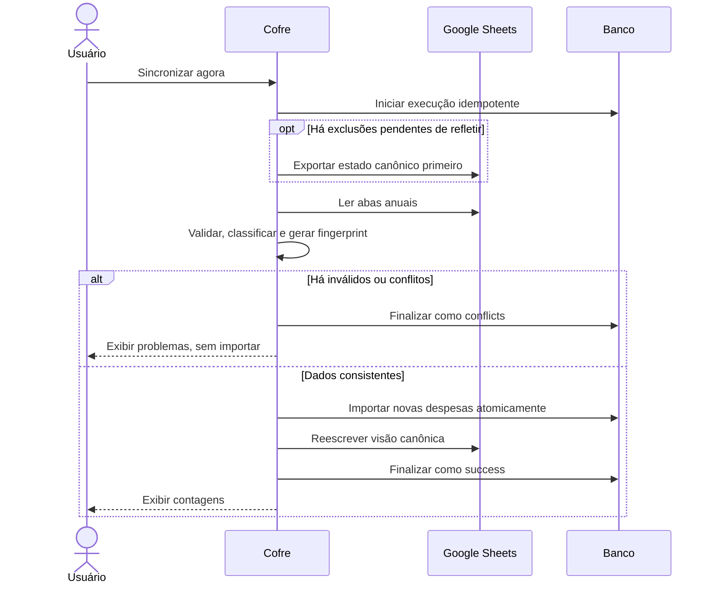

# Sincronização com Google Sheets

## Papel da planilha

**Decisão de aplicação.** O Cofre é a fonte canônica dos dados financeiros. A planilha é uma visão anual legível e um ponto controlado de entrada para novas despesas simples; não é um segundo banco com edição bidirecional irrestrita.

Essa assimetria evita que alterações livres em IDs, parcelas, recorrências ou referências produzam um estado impossível de validar no domínio.

## Modelo anual

Cada aba gerenciada representa um ano e contém:

- resumo anual de receitas, despesas e saldo;
- resumo dos doze meses por competência;
- despesas por categoria e mês;
- uma área de lançamentos;
- metadados ocultos de versão, proprietário e rastreabilidade.

Transações canceladas continuam exportadas como parte do histórico, mas não participam dos totais anuais, mensais ou por categoria. Categorias e cartões ativos alimentam as opções válidas da área de lançamento.

## O que pode ser importado

**Regra de domínio.** Pela planilha, o usuário pode acrescentar somente uma **nova despesa simples**. Ela deve possuir data válida para o layout, descrição, categoria de despesa e valor positivo; cartão ativo pode ser selecionado opcionalmente.

**Decisão de aplicação.** Recorrências e parcelamentos devem ser cadastrados no Cofre. Receitas novas e edições de transações existentes também não são aceitas pela planilha.

| Alteração encontrada na planilha | Resultado |
| --- | --- |
| Linha nova, sem ID, válida | Candidata à importação |
| Linha já exportada e intacta | Reconhecida como existente |
| Linha com ID desconhecido | Conflito |
| Linha existente alterada | Conflito; deve ser editada no Cofre ou restaurada |
| Categoria/cartão/recorrência de outro usuário ou inexistente | Conflito |
| Layout, ano ou proprietário incompatível | Sincronização recusada |

Uma nova despesa deve pertencer ao ano da aba. Nomes visíveis de categoria e cartão são resolvidos apenas contra recursos ativos do usuário autenticado.

## Fluxo manual

## Idempotência e concorrência

**Regra de domínio.** Repetir a mesma operação não pode duplicar despesas.

**Detalhe técnico atual.** Há duas proteções complementares:

- cada execução manual possui uma chave idempotente única por usuário; repetir a chave devolve o mesmo resultado;
- o conjunto de novas linhas possui fingerprint; uma importação já confirmada com o mesmo fingerprint não insere novamente.

A confirmação recalcula o preview. Se a planilha mudou entre preview e confirmação, a operação é recusada como obsoleta. A importação de várias linhas é atômica.

Somente uma sincronização pode ficar `running` por usuário. Uma execução abandonada por tempo excessivo é registrada como falha interrompida, permitindo recuperação sem duas gravações concorrentes.

## Conflitos e falhas

Uma execução termina em `success`, `conflicts` ou `failed` e registra contagens de linhas lidas, existentes, importadas, exportadas, inválidas e conflitantes. Problemas são armazenados de forma limitada para manter o histórico útil sem crescimento irrestrito de detalhes.

**Regra de domínio.** Dados inválidos ou conflitantes não são importados parcialmente. Falha do Google, token revogado ou planilha removida não apaga o estado canônico do Cofre.

Se a planilha for apagada, a integração passa a indicar arquivo ausente. Se a autorização for revogada, passa a exigir nova autorização.

## Exclusão e prevenção de ressurreição

Quando uma mutação destrutiva ocorre no Cofre, a integração é marcada para exportação completa. A próxima sincronização exporta antes de ler candidatos. A linha remota antiga desaparece antes que possa ser interpretada como nova.

Esse ordenamento é uma regra de consistência entre os dois meios, não apenas um detalhe visual da planilha.

## Desconexão e Demo

Desconectar remove a credencial persistida no Cofre e tenta revogar o acesso no Google, mas preserva o arquivo no Drive. A revogação remota é tratada como best effort.

Na Demo pública, a integração é explicitamente desativada. Nenhuma chamada Google, importação ou exportação simulada é tratada como sincronização real.
