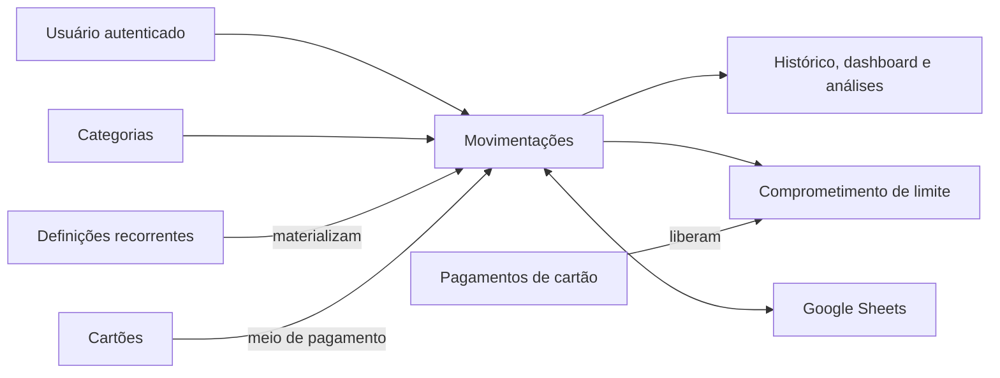

# Domínio do Cofre

Esta seção descreve o comportamento financeiro implementado no Cofre. O código, as migrations e os testes automatizados são a fonte de verdade; a documentação arquitetural permanece separada em [`docs/architecture/`](../architecture/index.md).

## Como ler esta documentação

Os documentos distinguem três tipos de afirmação:

- **Regra de domínio:** condição que dá significado ou preserva a consistência dos dados financeiros.
- **Decisão de aplicação:** escolha de produto ou de fluxo feita pelo Cofre, mas não uma verdade universal de finanças pessoais.
- **Detalhe técnico atual:** mecanismo usado hoje para realizar ou proteger uma regra; pode mudar sem alterar o significado do domínio.

## Mapa dos contextos

| Contexto | Documento | Perguntas respondidas |
| --- | --- | --- |
| Movimentações | [Transações e categorias](transactions-and-categories.md) | O que é receita, despesa, data, competência, status e categoria? |
| Crédito | [Cartões e parcelamentos](credit-cards-and-installments.md) | Como fechamento, vencimento, parcelas e limite funcionam? |
| Recorrência | [Gastos recorrentes](recurring-expenses.md) | Quando e como ocorrências mensais são geradas? |
| Retenção | [Ciclo de vida e exclusão](data-lifecycle.md) | O que é apagado, preservado ou bloqueado em cada operação? |
| Intercâmbio | [Sincronização com Google Sheets](google-sheets-sync.md) | Qual sistema é canônico e o que pode entrar pela planilha? |
| Propriedade | [Isolamento e invariantes transversais](ownership-and-invariants.md) | Como o Cofre impede acesso e relações entre usuários? |

## Modelo mental central

Uma **transação** é o fato financeiro elementar do Cofre. Receitas e despesas, parcelas e ocorrências recorrentes terminam representadas como transações. Dashboard, histórico, análises, resumo anual da planilha e limite de cartão derivam desses fatos, aplicando filtros próprios como competência, tipo e status.

Categorias, cartões e definições recorrentes são estruturas que dão contexto ou geram transações; não substituem o histórico transacional. Um pagamento de cartão é a exceção deliberada: ele libera limite, mas não cria outra despesa, pois a compra original já registrou o gasto.

## Escopo atual

- O domínio é de finanças pessoais, isolado por usuário.
- Os valores são nominais; não há conversão cambial nem contabilidade de múltiplas moedas.
- O saldo é `receitas − despesas`.
- Regras específicas de dízimos e ofertas **não fazem parte do domínio atual**. Migrations antigas registram sua introdução e a migration `0014_simplify_financial_model.sql` remove os respectivos campos para preservar uma evolução forward-only.
- A sincronização automática permanece futura; o fluxo implementado é manual.
- A Demo pública reproduz localmente o núcleo de movimentações, cartões, parcelas, recorrências e exclusões, mas não executa autenticação, banco remoto ou Google Sheets real.

## Limites e débitos conhecidos

Esta documentação não transforma comportamentos inconsistentes em regras desejadas. A auditoria encontrou estes pontos atuais:

1. Dashboard, análises, limite do cartão e resumos da planilha ignoram transações `cancelled`; o endpoint backend de resumo mensal soma hoje todos os status. O frontend não depende desse endpoint para seus cards atuais.
2. Não existe entidade de fatura ou conciliação por ciclo. Pagamentos são abatimentos cumulativos do compromisso total do cartão.
3. O estado de uma transação aceita `pending`, `confirmed` e `cancelled`, mas não há máquina de estados que restrinja transições.
4. Datas de transações são validadas pelo formato `YYYY-MM-DD`, mas não por existência no calendário; recorrências fazem a validação de data real.
5. A compatibilidade entre tipo da categoria e tipo da transação é verificada ao criar/editar a transação, mas alterar posteriormente o tipo de uma categoria usada não é bloqueado pelo fluxo atual.
6. Ao editar apenas o tipo de uma transação que já possui cartão, o vínculo existente não é revalidado se `cardId` não vier no mesmo pedido.
7. Alterar as datas de uma definição recorrente reinicia seu checkpoint. Registros existentes continuam protegidos contra duplicação, mas uma ocorrência antes excluída pode voltar a ser elegível nesse reprocessamento.
8. O histórico preserva os valores da transação, mas nome, cor e ícone da categoria são consultados pela relação atual; não existe snapshot visual da categoria.

Esses itens são registrados como débitos de domínio, sem alteração de regra nesta etapa documental.
