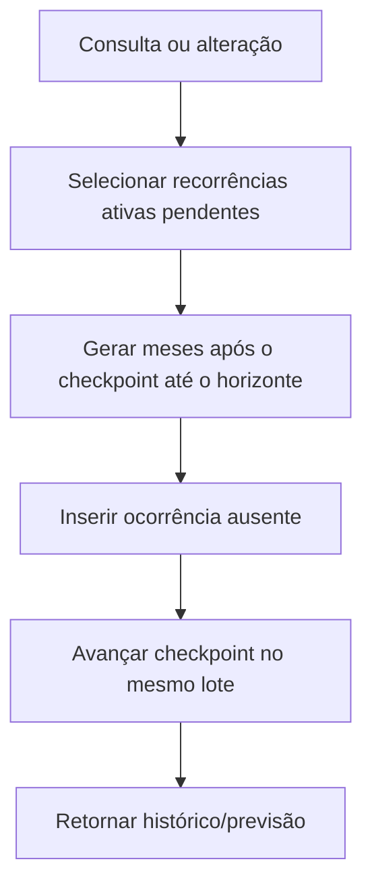

# Gastos recorrentes

## Definição e ocorrência

O Cofre separa dois conceitos:

- **definição recorrente:** instrução para lançar uma despesa mensal;
- **ocorrência:** transação concreta gerada para uma competência.

**Regra de domínio.** Gastos recorrentes são sempre despesas, exigem categoria de despesa e podem opcionalmente usar um cartão do mesmo usuário.

**Por que existe a separação.** A definição pode mudar ou deixar de existir, enquanto cada ocorrência já gerada representa um fato financeiro independente. Misturar os dois conceitos faria uma alteração futura reescrever o passado.

## Calendário de geração

Uma definição possui valor, descrição, categoria, dia do mês, início, fim opcional, atividade, cartão opcional e observações.

**Regra de domínio.** Para cada mês elegível, a ocorrência usa o dia configurado. Se o dia não existe naquele mês, usa o último dia válido: dia 31 resulta em 28 ou 29 em fevereiro, conforme o ano.

**Regra de domínio.** Nenhuma ocorrência pode ficar antes do início ou depois do fim exato da definição. Definições inativas não geram novos lançamentos.

**Decisão de aplicação.** A geração é materializada sob demanda:

- criação e alteração conciliam até o mês atual;
- consultas comuns conciliam até o mês atual;
- consulta de um mês futuro ou de um intervalo com data final concilia até o período pedido.

Isso permite visualizar previsões sem exigir um agendador permanente.

## Idempotência e desempenho

**Regra de domínio.** Uma definição pode produzir no máximo uma ocorrência por competência mensal. Repetir a conciliação para o mesmo horizonte não duplica lançamentos.

**Detalhe técnico atual.** Essa garantia combina:

- índice único por definição recorrente, ano e mês;
- inserção que ignora duplicatas;
- checkpoint `generated_through` por definição;
- gravação das ocorrências e avanço do checkpoint no mesmo lote.

O checkpoint evita reprocessar desde o início em toda consulta. Uma recorrência iniciada em 2019 é reconciliada uma vez; consultas iguais verificam zero meses e a próxima competência processa apenas o delta.

## Relação com cartões

**Regra de domínio.** Uma ocorrência com cartão referencia o cartão diretamente, não é parcela e compromete o limite uma vez enquanto não estiver cancelada.

**Decisão de aplicação.** Se o cartão já vinculado for posteriormente inativado, ocorrências históricas permanecem, mas novas ocorrências deixam de ser geradas até que a definição seja ajustada ou o cartão volte a ser utilizável. É permitido editar/desativar a definição histórica sem exigir que esse cartão esteja ativo; criar ou trocar o vínculo exige cartão ativo.

## Preservação histórica

**Regra de domínio.** Alterar valor, descrição, categoria ou cartão da definição não reescreve ocorrências existentes. A mudança vale para ocorrências ainda não materializadas.

Exemplo:

1. assinatura de R$ 30 gera janeiro e fevereiro;
2. o valor da definição muda para R$ 35;
3. janeiro e fevereiro continuam em R$ 30;
4. março, quando gerado, usa R$ 35.

Esse é o principal snapshot histórico das recorrências: os dados efetivos ficam copiados na transação no momento da geração.

## Cancelar, excluir ocorrência e excluir definição

Cancelar uma ocorrência preserva a transação com estado `cancelled` e impede que ela conte em análises e limite. A unicidade mensal impede criar outra ocorrência para a mesma competência.

Excluir uma ocorrência remove fisicamente aquela transação. Enquanto o checkpoint da definição já cobre sua competência, ela não é recriada numa nova consulta.

Ao excluir a definição, o usuário escolhe explicitamente:

| Modo | Definição | Ocorrências geradas |
| --- | --- | --- |
| Preservar histórico | Excluída fisicamente | Mantidas e desvinculadas da definição |
| Excluir com histórico | Excluída fisicamente | Excluídas na mesma transação de banco |

**Decisão de aplicação.** No modo de preservação, as transações mantêm os demais dados e o indicador descritivo de recorrência, mas deixam de possuir `recurringExpenseId`; não podem mais gerar novos meses.

**Detalhe técnico atual.** Alterar `startDate` ou `endDate` reinicia o checkpoint para reavaliar o intervalo. A unicidade protege ocorrências ainda existentes, mas uma ocorrência fisicamente excluída dentro do intervalo reavaliado pode voltar a ser elegível. Esse caso é um débito conhecido, não uma garantia de preservação absoluta após mudança de datas.
