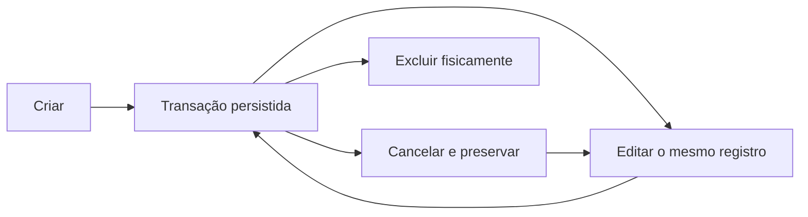

# Transações e categorias

## Transação como fato financeiro

**Regra de domínio.** Toda movimentação possui um valor estritamente positivo e um tipo: `income` (receita) ou `expense` (despesa). O sinal não é armazenado no valor; o tipo determina se ele entra ou sai do saldo.

```text
saldo = soma das receitas − soma das despesas
```

Isso evita representar a mesma ideia de duas maneiras, como “despesa positiva” e “receita negativa”, que tornariam filtros e agregações ambíguos.

**Decisão de aplicação.** Uma transação também pode registrar descrição, observações, origem, tags, indicadores de recorrência/fixidez e estado. `isRecurring` é dado explícito: o Cofre não tenta inferir recorrência pelo texto da descrição.

## Receita, despesa e categoria

**Regra de domínio.** Toda transação referencia uma categoria do mesmo usuário e do mesmo tipo. Uma receita não pode ser cadastrada em categoria de despesa, nem o inverso. Isso mantém agrupamentos, gráficos e filtros semanticamente corretos.

**Regra de domínio.** Dentro de um usuário, o nome de categoria é único por tipo sem diferenciar maiúsculas de minúsculas. Assim, `Mercado` e `mercado` não podem coexistir como duas categorias de despesa; uma categoria de receita chamada `Mercado` ainda é permitida por ter outro tipo.

**Decisão de aplicação.** Categorias possuem cor, ícone, ordem e estado ativo. Inativar retira a categoria das listagens padrão para novos usos, mas não apaga nem torna inacessíveis as transações históricas vinculadas.

**Detalhe técnico atual.** A transação guarda o ID da categoria, e a leitura combina esse vínculo com o cadastro atual. Portanto, valor, tipo, data e competência pertencem ao fato histórico, enquanto uma alteração posterior no nome, cor ou ícone da categoria aparece também ao visualizar o passado.

## Data e competência

**Regra de domínio.** `date` identifica a data do lançamento, enquanto competência identifica o mês e o ano em que ele participa dos resumos financeiros. Elas normalmente coincidem, mas são conceitos separados.

**Decisão de aplicação.** Se competência não for enviada, ela é derivada da data. Ao editar a data, a competência acompanha a nova data, exceto quando o usuário informa explicitamente uma nova competência na mesma edição. Essa exceção permite ajustar o período contábil sem falsificar a data registrada.

Exemplo: uma transação com data `2026-09-28` pode ser atribuída à competência `10/2026`. Filtros mensais, dashboard e análises usam a competência; um filtro por intervalo de datas usa `date`.

## Estados e efeitos

Os estados aceitos são:

| Estado | Significado operacional atual |
| --- | --- |
| `confirmed` | Movimentação confirmada. |
| `pending` | Movimentação ainda pendente, mas incluída nas agregações do frontend e da planilha. |
| `cancelled` | Movimentação preservada no histórico, porém ignorada pelo dashboard, análises, resumos da planilha e limite de cartão. |

**Decisão de aplicação.** O histórico pode listar qualquer estado e permite filtrá-lo. O sistema aceita mudança entre os três estados sem uma máquina de transição adicional.

**Débito atual.** O resumo mensal oferecido diretamente pela API ainda soma transações canceladas, ao contrário das agregações efetivamente usadas pelo dashboard e das regras do cartão/planilha. Esse desvio está apenas documentado nesta etapa.

## Criação, edição e exclusão



**Regra de domínio.** Editar uma movimentação altera o mesmo fato; não cria uma cópia. Excluir remove definitivamente a linha correspondente.

**Decisão de aplicação.** A prévia de exclusão informa se a transação é ocorrência recorrente, qual redução provocará no limite e quantas parcelas existem no mesmo grupo. Mesmo em uma compra parcelada, a exclusão atua somente sobre a parcela selecionada; as parcelas irmãs não são apagadas nem recalculadas automaticamente.

**Regra de domínio.** Se a transação não cancelada usa cartão, sua exclusão deixa de comprometer o limite. Uma transação cancelada já não contribuía para esse cálculo.

## Histórico e snapshots

O Cofre não trata toda transação como imutável: ela pode ser editada ou excluída explicitamente pelo usuário. A imutabilidade relevante é **não retroativa**:

- mudar uma definição recorrente não reescreve ocorrências já geradas;
- editar uma parcela não propaga a alteração às parcelas irmãs;
- pagar o cartão não altera nem duplica as compras originais;
- inativar uma categoria ou cartão não apaga fatos antigos.

**Por que existe.** Sem essa separação, uma mudança feita para o futuro poderia reescrever meses encerrados e tornar impossível explicar a origem de um valor histórico.

O snapshot é parcial. A transação guarda seus valores, datas, competência, estado, origem e metadados de parcela/recorrência; categoria e cartão continuam sendo referências a entidades atuais.
